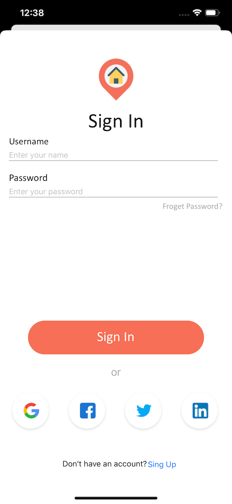

# Roomy
[![Swift Version][swift-image]][swift-url]

## Introduction

Application for finding roomamtes online built using Swift 5 & IOS13

## To-Do
- [x] Launch Screen
- [x] Landing Screen
- [x] Registration of new users/ Login functionality.
- [x] Rooms Screen
- [x] Details Screen
- [x] Signup Screen
- [x] Sign Up API
- [x] Sign In API
- [x] Store Auth Token using keychain
- [x] Get All Rooms API
- [x] Add Realme Database

### Start Screen
 

### Signin Screen

### Rooms Screen
   

### Details Screen

## Requirements

- iOS 12.0+
- Xcode 11
- Swift 5  

## Meta

Mahmoud Abdelshafi – mahmoudabdelshafi4@gmail.com

[swift-image]:https://img.shields.io/badge/swift-5.0-orange.svg?style=flat
[swift-url]: https://swift.org/

